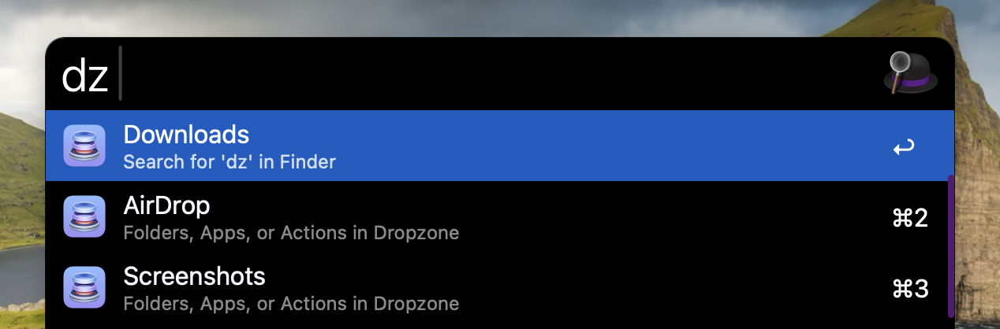

# Dropzone Launcher

Launch Dropzone folders, apps, and actions directly from Alfred.

## Features

- Search and launch Dropzone folders, apps, and actions from Alfred
- Supports instant keyword search
- Works with any Dropzone item type
- Quick access to your most-used Dropzone items

## Usage

1. Type the keyword `dz` in Alfred
2. Start typing to search for Dropzone items
3. Press Enter to launch the selected item

## Configuration

- Default keyword: `dz`
- You can change the keyword in Alfred's workflow settings

## Requirements

- Alfred 5 with Powerpack
- [Dropzone](https://aptonic.com/) installed

## License

MIT License - see [LICENSE](../LICENSE) file
