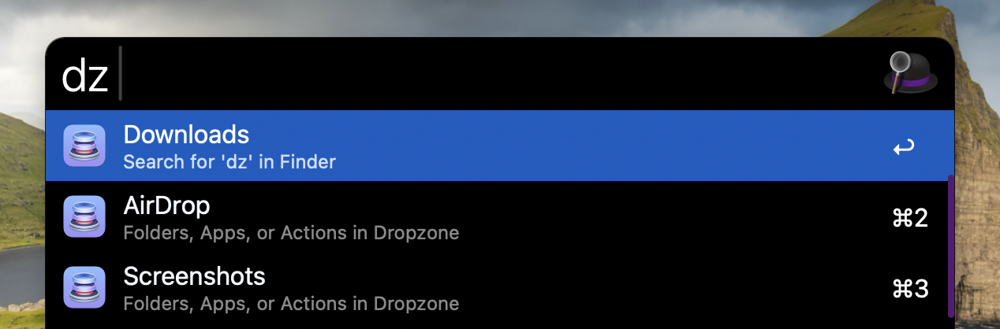

# Dropzone Launcher

Launch Dropzone folders, apps, and actions directly from Alfred.

## Features
- Search and launch Dropzone folders, apps, and actions from Alfred
- Supports instant keyword search
- Works with any Dropzone item type
- Quick access to your most-used Dropzone items

## Usage
1. Install the workflow in Alfred
2. Type the keyword `dz` in Alfred
3. Start typing to search for Dropzone items
4. Press Enter to launch the selected item

## Installation
1. Download `dropzone-launcher.alfredworkflow`
2. Double-click the file to install in Alfred
3. The workflow will be ready to use with the `dz` keyword

## Requirements
- macOS
- Alfred 5 with Powerpack
- [Dropzone](https://aptonic.com/) installed

## Configuration
- Default keyword: `dz`
- You can change the keyword in Alfred's workflow settings
